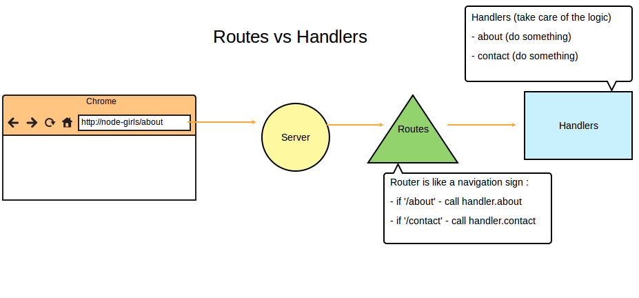

# Stretch goals!

If you finish early, or want to keep working on this as a side project after the workshop, here's some ideas on how to upgrade your creation.

It would be a great idea to create a new branch on Git for yourself, so you can experiment and not have to worry about ruining your previous code.

### Display the date
 Edit `script.js` so that the timestamps for the previous blog posts are displayed in a human-readable way.

 * [Javascript dates](http://www.w3schools.com/jsref/jsref_obj_date.asp)

### More modularisation!
Currently, `handler.js` is a combination of decisions and actions.  The decisions are the  the if-else branches that look at the request url, and the actions are the bits inside the curly brackets.

You could split out the decision part to its own file, `routes.js`.  Then the actual actions (so, the functions you call) would remain in `handler.js`.  `routes.js`

### Use a database
Instead of writing to a file on your hard drive, you could save your blog posts in a database, which would be much quicker in terms of performance if there was a lot of data.

* [MongoDB](https://docs.mongodb.org/getting-started/node/)
[Redis]

### Host your blog online!
Heroku is a what we call a *Platform as a Service*.  You upload your code to them and it will live on one of their servers, meaning you can access it on the general internet from anywhere!  

Heroku is good because they have a lot of free options for small-scale apps, like yours.

* [Heroku](https://www.heroku.com/platform)

## Extra reading
There's great resources out there for continuing your Node.js journey.  Here they are:

* [NodeSchool](nodeschool.io) have really great interactive tutorials for all sorts of Node technologies.
